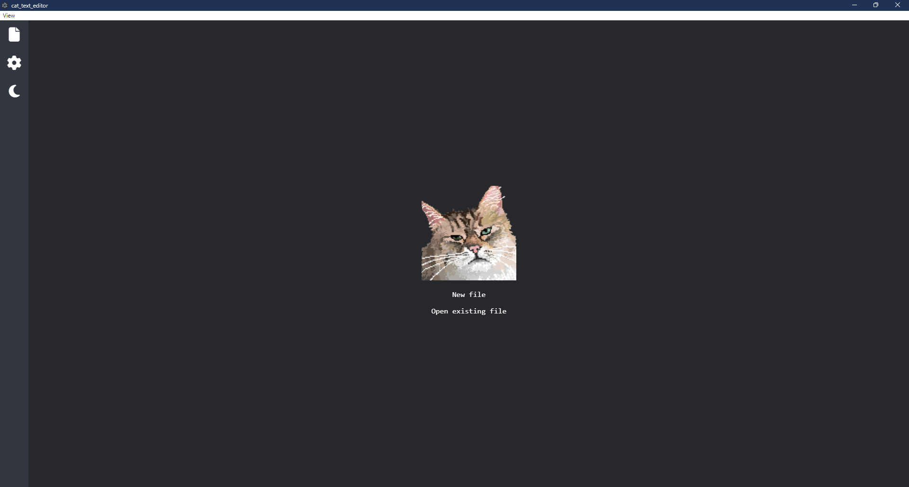

# A Cat Text Editor

! In development !

# -- TODO --

- DETECT && NORMALIZE EOL's
- NORMALIZE TABS (handle \t char)
- DO THE ENTER (new line) LOGIC => normalize entered new line to the current file standard EOL char
- BUG WHEN DELETING TEXT IN PIECE TABLE (piece offsets (line, column) are not properly calculated)